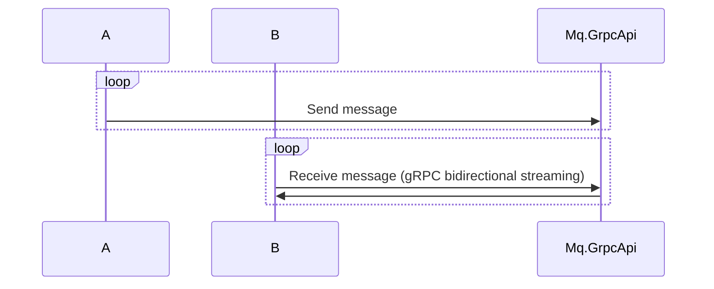

# Тестовое задание по вакансии C# developer

Given: 
System A generates messages (simple strings) in random way. That system may generate N messages per second and then be idle for hours. Every message has its own
priority. 
System B can process messages in some way, e.g. by sending them to stdout/console. Message processing logic is very slow, it is limited by 1 message/second. 

Problem definition: 
Implement mentioned program logic (systems A and B). 
The implementation of the system A should generate messages. The implementation of the System B should receive generated messages and process them (e.g. send to stdout)
with the mentioned performance limitation. 
Processing should be priority based - messages with higher priority must be processed first 
No messages generated by the System A can be lost, all messages should be processed according to their priority 

# О проекте

- A - сервис для отправки сообщения
- B - сервис для обработки сообщения
- Mq.Lib - реализация mq, содержит:
    - gRpc.Mq - содержит proto файл, конракт для работы с mq
    - Mq.Client - содержит интерфейсы для работы с mq (зарегестировать очередь, отправить/получить сообщение)
    - Mq.Client.DependencyInjection - содержит регистрацию зависимостей для работы с mq клиентом
    - Mq.Server - содержит реализация работы mq (очередь в памяти)
    - Mq.DependencyInjection - содержит регисрацию зависимостей для работы mq сервера
    - Mq.GrpcApi - апи для взаимодействия с mq

Для достоверной доставки сообщения используется подход `At-least-once delivery` (“как минимум однократная доставка”):
При получении сообщения, сообщение кладется в MemoryCache и устанавливается callback по таймауту, который повторно кладет сообщение в очередь

### Схема работы приложения:

